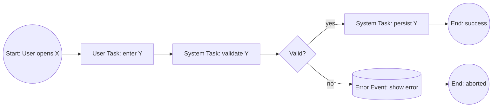

# BPMN — Theodo Standard

Reference: [BPMN (Business Process Model and Notation) — Theodo Academy](https://www.notion.so/m33/BPMN-Business-Process-Model-and-Notation-2408f3776f4f80d3a193c50565f4530b)

## Intent

> Guide product engineering, secure estimations, and uncover risks before delivery by aligning the team on the full feature flow, including edge cases and system logic.

**The value is the discussion, not the diagram.** A BPMN session is a workshop that aligns the team on what will be built and where the hard parts are. The diagram is the artifact of that conversation.

## When to use this skill

Trigger this skill when the user mentions:
- BPMN, process flow, feature flow, Epic flow
- Spec'ing an Epic, estimating an Epic, identifying risks before delivery
- Aligning PM, Tech Lead, Developer, Designer on a feature

Do **not** use this for non-product-engineering process modeling (use the generic `BPMN` skill instead).

## Phase 1 — Required inputs (block until present)

Before drafting anything, confirm all five inputs exist. If any is missing, stop and ask the user to provide it.

| # | Input | Why it matters |
|---|-------|----------------|
| 1 | Clear Epic scope and business intent | Without it, the BPMN drifts into unrelated work |
| 2 | Tech investigation done | Without it, the team can't model system behavior accurately |
| 3 | Finalized UX mockups | Without them, "what does the user see?" can't be answered |
| 4 | Pre-spotted edge cases | Forces thinking before the workshop, not during |
| 5 | Workshop attendees have read the Epic and mockups | Ensures everyone is clear on why / who / where / when / what |

**Required attendees:** PM · Tech Lead · Developer who will own the feature · Designer.

## Phase 2 — Run the workshop

Walk the flow from first user interaction to final state, ideally with mockups visible. At every step ask:

| Question | What it surfaces |
|----------|------------------|
| What happens on **success**? | Happy path |
| What happens on **error**? | Exception flow, retry, escalation |
| What does the **system** do? | Backend logic, side effects |
| What does the **user** see? | UI state, feedback, screen transitions |
| **What if…?** (repeat liberally) | Edge cases, weird user behaviors, technical constraints |

Challenge each other on where the complexity actually sits. Don't accept "it's straightforward" — push until the team can articulate the failure modes.

## Phase 3 — Build the diagram step by step

Start from the first screen / user action. For each step:
1. Place the activity using the Theodo nomenclature (below)
2. Add success and error branches
3. Distinguish system actions vs. user-visible state
4. Add the corresponding mockup snippet next to the step when possible

### Theodo BPMN nomenclature (the only allowed elements)

| Element | Type | Purpose |
|---------|------|---------|
| **Start Event** | événement | Trigger that starts the flow |
| **End Event** | événement | Terminal state of the flow |
| **Error Event** | événement | Error condition (caught or thrown) |
| **Event** (intermediate) | événement | Mid-flow event (timer, signal, message wait) |
| **Activity (Task)** | tâche | Atomic unit of work |
| **Task sending a message** | tâche | Outbound message/notification |
| **Task receiving a message** | tâche | Inbound message/callback |
| **Sub-process** | tâche | Reusable or collapsible nested flow |
| **Exclusive Gateway** (XOR) | gateway | One path based on a condition |
| **Inclusive Gateway** (OR) | gateway | One or more paths based on conditions |
| **Parallel Gateway** (AND) | gateway | All paths execute concurrently |
| **Event-based Gateway** | gateway | Wait for one of several events |
| **Pool / Lane** | autre | Participant (system / role) and sub-roles |
| **Comment** | autre | Annotation tied to an element |

If you find yourself wanting to invent a symbol, you're off-standard. Stop and use one of the above.

## Phase 4 — Validate

Before declaring the BPMN done:

| Validator | What they confirm |
|-----------|-------------------|
| **Developers who will work on the feature** | The diagram is unambiguous; no edge case or technical complexity is missing |
| **Client** | The feature flow matches their expectation |

If either rejects, return to Phase 2.

## Phase 5 — Use it

The BPMN is not a deliverable in isolation. It must feed:
1. **Epic specification** — attach the BPMN to the Epic
2. **User stories** — derive each story from a step or branch
3. **QA tests** — every success and error path becomes a test case (write or execute)

If the BPMN isn't being used for these three things, the workshop's value isn't being captured.

## Tooling

| Tool | Use? | Notes |
|------|------|-------|
| **bpmn.io** | ✅ | Free, single-user |
| **Lucidchart** | ✅ | Best for collaborative work |
| **Miro** | ✅ | Use [this template](https://miro.com/app/board/uXjVJIZqPiw=/) (access code: 97454310) |
| **Figjam** | ✅ | Template in progress |
| **Mermaid (this skill's draft output)** | ⚠️ Draft only | OK for solo scaffolding; not the final deliverable |
| **Whimsical** | ❌ | Do not use |

## Mermaid scaffold (for early drafting only)

The final BPMN must be in an approved tool (above). Mermaid is acceptable as a pre-workshop sketch.

**Orientation: always horizontal (`flowchart LR`).** BPMN is read left-to-right (trigger → end). Never use `TD`/`TB` unless explicitly requested.

**Edges: always angular (orthogonal).** Prepend every diagram with `%%{init: {'flowchart': {'curve': 'step', 'htmlLabels': true}}}%%` so edges route at 90° angles like bpmn.io / Lucidchart, not as curves.

**Limitations of Mermaid for BPMN:**
- No proper event markers (timer clock, message envelope, error bolt)
- No native pool/lane semantics (subgraphs only approximate them)
- Not collaborative — fine for drafting, not for the workshop itself

## Output checklist for any BPMN deliverable

Before handing off:

- [ ] All five required inputs were present at workshop start
- [ ] All four roles attended (PM, TL, Dev owner, Designer)
- [ ] Every step answers success path
- [ ] Every step answers error path
- [ ] System actions and user-visible state are distinguished
- [ ] Only Theodo nomenclature elements used
- [ ] Mockups linked to relevant steps (where applicable)
- [ ] Validated by feature developers
- [ ] Validated by the client
- [ ] Attached to the Epic
- [ ] User stories drafted from the diagram
- [ ] QA test cases drafted from success and error paths
- [ ] Final version lives in an approved tool (bpmn.io / Lucidchart / Miro / Figjam) — not Whimsical, not Mermaid only

## Practice

- [Simulator 1: Nomenclature](https://www.notion.so/28e8f3776f4f8070a892c4f4c5f74102)
- [Simulator 2: Function of BPMN elements](https://www.notion.so/28e8f3776f4f8009b9c7fe5e0127206b)

## Related skills

- `BPMN` — generic process modeling (use for non-product-engineering flows)
