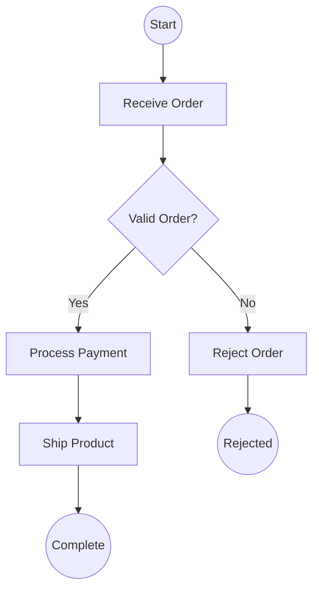
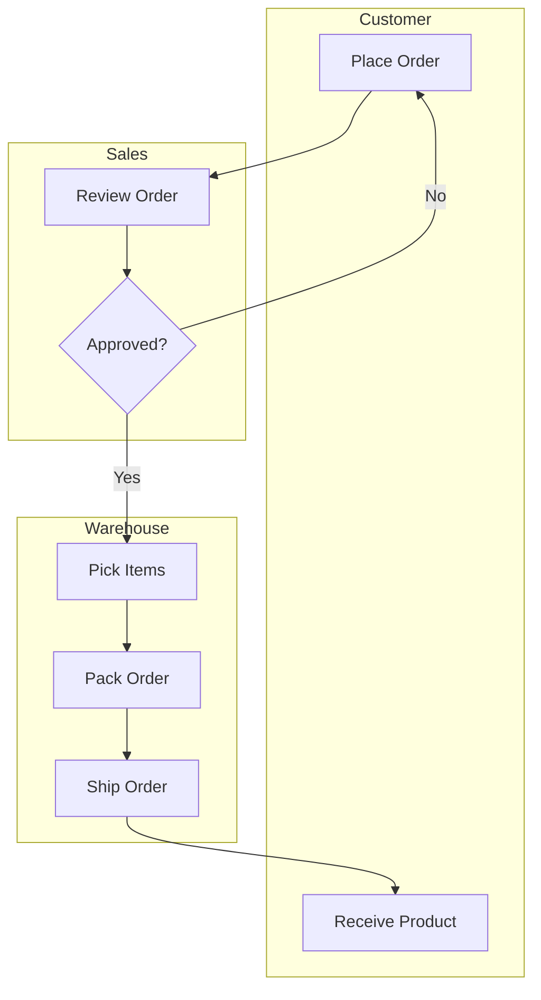
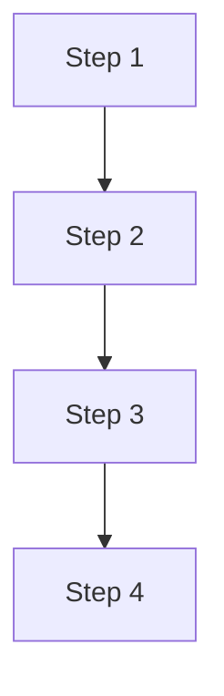
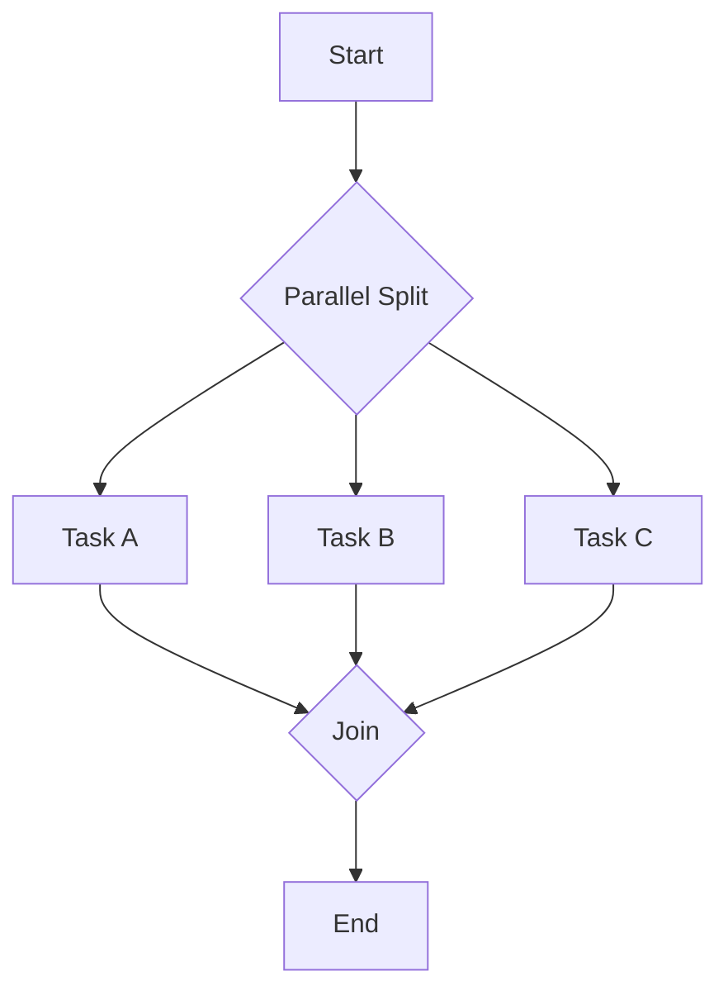
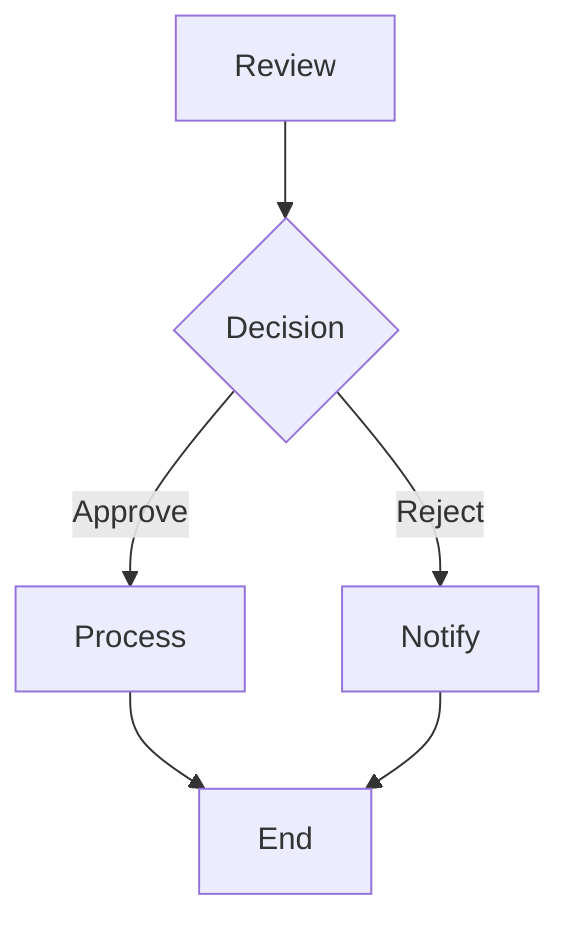
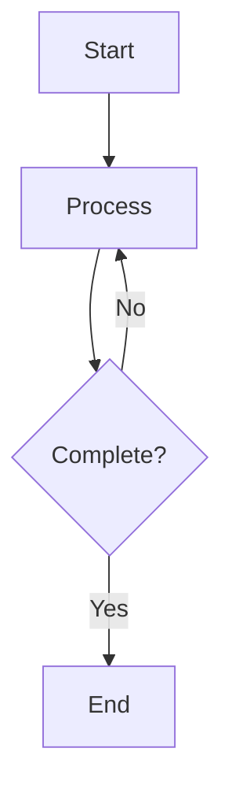
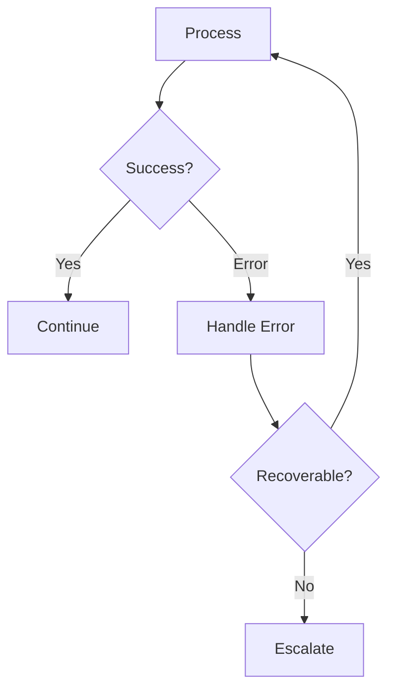

# Process Modeling (Vertical)

## When to Use This Skill

Use this skill when:

- The user explicitly asks for a **vertical** BPMN diagram
- The process is mostly linear with few parallel branches (reads better top-down)
- The diagram needs to fit a portrait page or column

For all other cases, default to `/BPMN` (horizontal) which matches Theodo standard reading direction.

## Overview

Create and document business processes using BPMN (Business Process Model and Notation) and flowchart notation. Visualize activities, decisions, events, and participant interactions for process understanding and improvement.

## What is Process Modeling?

**Process modeling** creates visual representations of how work flows through an organization. It documents:

- **Activities**: What work is performed
- **Sequence**: Order of activities
- **Decisions**: Choice points and conditions
- **Participants**: Who performs each step
- **Events**: What triggers and ends the process

## BPMN Core Elements

### Activities (Rectangles)

| Type | Symbol | Description |
|------|--------|-------------|
| **Task** | Rectangle | Atomic work unit |
| **Sub-Process** | Rectangle with + | Contains child process |
| **Call Activity** | Rectangle with thick border | Invokes reusable process |

**Task Types:**

| Type | Description |
|------|-------------|
| User Task | Human interaction required |
| Service Task | Automated system action |
| Script Task | Script/code execution |
| Business Rule Task | Decision table evaluation |
| Send Task | Message sent |
| Receive Task | Message received |
| Manual Task | Physical work without system |

### Events (Circles)

| Position | Symbol | Description |
|----------|--------|-------------|
| **Start** | Thin circle | Process trigger |
| **Intermediate** | Double circle | Mid-process event |
| **End** | Thick circle | Process termination |

**Event Types:**

| Type | Trigger |
|------|---------|
| None | Unspecified start/end |
| Message | Message received/sent |
| Timer | Time-based trigger |
| Error | Error condition |
| Signal | Broadcast signal |
| Terminate | Process termination |

### Gateways (Diamonds)

| Type | Symbol | Description |
|------|--------|-------------|
| **Exclusive (XOR)** | Diamond with X | One path based on condition |
| **Parallel (AND)** | Diamond with + | All paths execute |
| **Inclusive (OR)** | Diamond with O | One or more paths |
| **Event-Based** | Diamond with circle | Wait for events |

### Connectors

| Type | Symbol | Description |
|------|--------|-------------|
| **Sequence Flow** | Solid arrow | Order of activities |
| **Message Flow** | Dashed arrow | Messages between pools |
| **Association** | Dotted line | Artifacts to elements |

### Swimlanes

| Type | Description |
|------|-------------|
| **Pool** | Represents a participant (organization/system) |
| **Lane** | Subdivisions within a pool (roles/departments) |

## Workflow

### Phase 1: Define Scope

#### Step 1: Identify Process Boundaries

```markdown
## Process Definition

**Process Name:** [Name]
**Purpose:** [Why this process exists]
**Scope:**
  - **Starts When:** [Trigger event]
  - **Ends When:** [Completion criteria]
  - **Includes:** [In-scope activities]
  - **Excludes:** [Out-of-scope activities]

**Participants:**
| Pool | Lanes (Roles) |
|------|---------------|
| [Org/System] | [Role 1], [Role 2] |
```

#### Step 2: Choose Model Type

| Type | When to Use |
|------|-------------|
| **As-Is** | Documenting current state |
| **To-Be** | Designing future state |
| **High-Level** | Overview, communication |
| **Detailed** | Implementation, automation |

### Phase 2: Model the Process

#### Step 1: Identify Main Path (Happy Path)

1. Start event (trigger)
2. Main sequence of activities
3. End event (completion)

#### Step 2: Add Decision Points

For each decision:

- Type of gateway (XOR/AND/OR)
- Conditions for each path
- Reconvergence point

#### Step 3: Add Exception Paths

- Error handling
- Timeout scenarios
- Escalation paths

#### Step 4: Add Participants

- Assign activities to lanes
- Model inter-participant communication
- Add message flows between pools

### Phase 3: Validate and Document

#### Step 1: Validate Completeness

| Check | Question |
|-------|----------|
| All paths connected | Do all activities have incoming and outgoing flows? |
| No dead ends | Do all paths reach an end event? |
| Gateways balanced | Are split gateways matched with joins? |
| Roles assigned | Is every activity in a lane? |
| Triggers defined | Does every start event have a clear trigger? |

## Output Formats

### Diagram orientation — VERTICAL (top-down)

This skill always uses `flowchart TD`. Trigger at the top, end events at the bottom.

### Mermaid Flowchart (BPMN-Style)



### Swimlane Diagram



## Common Process Patterns

### Sequential Process



### Parallel Split and Join



### Exclusive Decision



### Loop / Iteration



### Exception Handling



## Best Practices

| Practice | Description |
|----------|-------------|
| Start simple | Begin with happy path, add complexity |
| One start, one end | Per pool, ideally |
| Name activities | Use verb-noun format (e.g., "Review Order") |
| Label gateways | Show the decision question |
| Label conditions | Describe each outgoing path |
| Balance gateways | Split and join with matching types |
| Avoid crossing lines | Rearrange for clarity |
| Document exceptions | Show error handling paths |

## Related Skills

- `BPMN` — same notation but horizontal (`flowchart LR`); default for Theodo standard
- `BPMN-theodo` — Theodo product-engineering standard with workshop methodology
