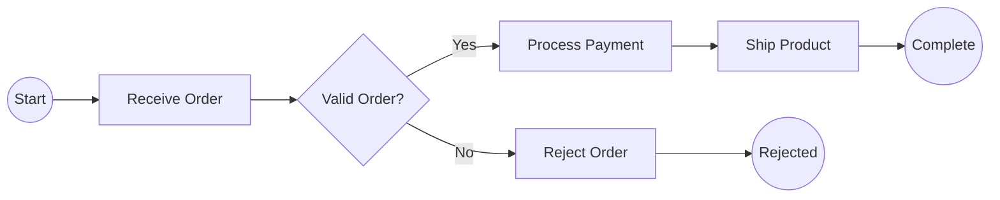
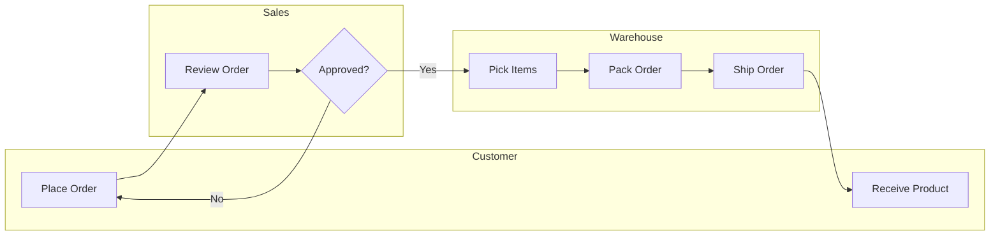
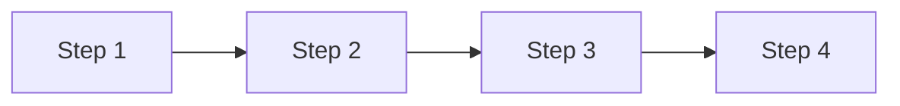
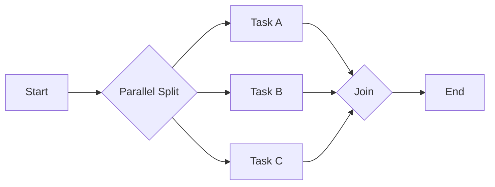
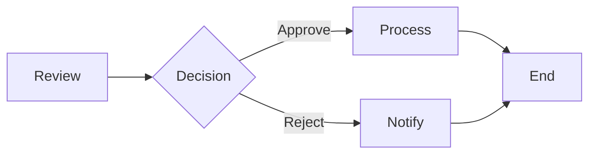
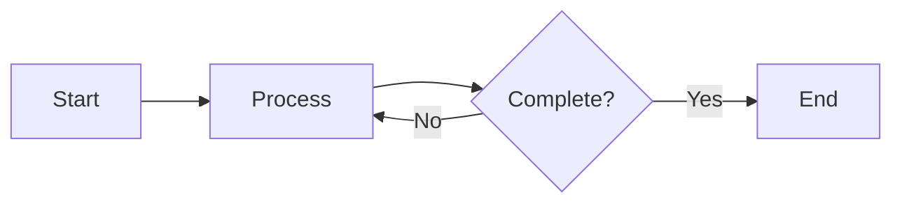
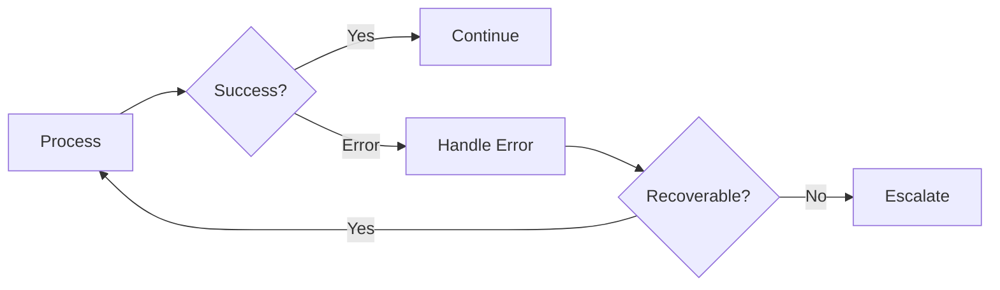

# Process Modeling

## When to Use This Skill

Use this skill when:

- **Process Modeling tasks** - Working on process modeling using bpmn notation and flowchart patterns. creates process diagrams with activities, gateways, events, swimlanes, and decision points for workflow documentation
- **Planning or design** - Need guidance on Process Modeling approaches
- **Best practices** - Want to follow established patterns and standards

## Overview

Create and document business processes using BPMN (Business Process Model and Notation) and flowchart notation. Visualize activities, decisions, events, and participant interactions for process understanding and improvement.

## What is Process Modeling?

**Process modeling** creates visual representations of how work flows through an organization. It documents:

- **Activities**: What work is performed
- **Sequence**: Order of activities
- **Decisions**: Choice points and conditions
- **Participants**: Who performs each step
- **Events**: What triggers and ends the process

## BPMN Element Nomenclature (Theodo standard)

Reference: [Eléments BPMN — Theodo Notion standard](https://www.notion.so/m33/BPMN-Business-Process-Model-and-Notation-2408f3776f4f80d3a193c50565f4530b).

These are the **only 14 elements** allowed in any BPMN this skill produces. Do not invent shapes (no "Service Task", "Manual Task", "Call Activity", etc.). If a concept doesn't fit one of these, rephrase the activity until it does.

| # | Element | Type | Mermaid syntax | Class for styling | Purpose |
|---|---------|------|----------------|-------------------|---------|
| 1 | **Start Event** | événement | `Id((Label))` | `:::startEvent` | Trigger that starts the flow |
| 2 | **End Event** | événement | `Id(((Label)))` | `:::endEvent` | Terminal state of the flow |
| 3 | **Error Event** | événement | `Id[(Label)]` | `:::errorEvent` | Error condition (caught or thrown) |
| 4 | **Event** (intermediate) | événement | `Id((Label))` | `:::intermediateEvent` | Mid-flow timer / signal / message wait |
| 5 | **Activity (Task)** | tâche | `Id[Label]` | `:::task` | Atomic unit of work |
| 6 | **Task sending a message** | tâche | `Id[/Label/]` | `:::sendTask` | Outbound message / notification |
| 7 | **Task receiving a message** | tâche | `Id[\Label\]` | `:::receiveTask` | Inbound message / callback |
| 8 | **Sub-process** | tâche | `Id[[Label]]` | `:::subprocess` | Reusable / collapsible nested flow |
| 9 | **Exclusive Gateway** (XOR) | gateway | `Id{Label}` | `:::xorGateway` | One path based on a condition |
| 10 | **Inclusive Gateway** (OR) | gateway | `Id{Label}` | `:::orGateway` | One or more paths based on conditions |
| 11 | **Parallel Gateway** (AND) | gateway | `Id{Label}` | `:::andGateway` | All paths execute concurrently |
| 12 | **Event-based Gateway** | gateway | `Id{Label}` | `:::eventGateway` | Wait for one of several events |
| 13 | **Pool / Lane** | autre | `subgraph Name ... end` | n/a | Participant (system / role) and sub-roles |
| 14 | **Comment** | autre | `Id>Label]` | `:::comment` | Annotation tied to an element |

### Mandatory styling block

Every diagram must include this `classDef` block so each element type is visually distinct (Mermaid can't render true BPMN markers — color does the job):

```
classDef startEvent       fill:#FFE4B5,stroke:#FF8C00,stroke-width:2px
classDef intermediateEvent fill:#FFF7CC,stroke:#FF8C00,stroke-width:2px,stroke-dasharray:3 2
classDef endEvent         fill:#DCFCE7,stroke:#15803D,stroke-width:3px
classDef errorEvent       fill:#FEE2E2,stroke:#B91C1C,stroke-width:2px
classDef task             fill:#E0F2FE,stroke:#0369A1,stroke-width:1px
classDef sendTask         fill:#BAE6FD,stroke:#0369A1,stroke-width:1px
classDef receiveTask      fill:#BAE6FD,stroke:#0369A1,stroke-width:1px
classDef subprocess       fill:#E0F2FE,stroke:#0369A1,stroke-width:3px
classDef xorGateway       fill:#FEF3C7,stroke:#B45309,stroke-width:2px
classDef orGateway        fill:#FDE68A,stroke:#B45309,stroke-width:2px
classDef andGateway       fill:#FCD34D,stroke:#B45309,stroke-width:2px
classDef eventGateway     fill:#FBBF24,stroke:#B45309,stroke-width:2px
classDef comment          fill:#F3F4F6,stroke:#6B7280,stroke-width:1px,stroke-dasharray:3 2
```

### Connectors

| Type | Mermaid | When to use |
|------|---------|-------------|
| Sequence flow | `-->` | Order of activities within a pool |
| Message flow | `-.->` | Messages between pools (e.g. Manufacturer ↔ NB) |
| Association | `-..-` | Comment attached to an element |

### Banned elements

Do **not** use any element outside the table above. Specifically: no "Service Task", "User Task", "Manual Task", "Script Task", "Business Rule Task", "Call Activity" — these are standard BPMN 2.0 but **not part of the Theodo nomenclature**.

## Workflow

### Phase 1: Define Scope

#### Step 1: Identify Process Boundaries

```markdown
## Process Definition

**Process Name:** [Name]
**Purpose:** [Why this process exists]
**Scope:**
  - **Starts When:** [Trigger event]
  - **Ends When:** [Completion criteria]
  - **Includes:** [In-scope activities]
  - **Excludes:** [Out-of-scope activities]

**Participants:**
| Pool | Lanes (Roles) |
|------|---------------|
| [Org/System] | [Role 1], [Role 2] |
```

#### Step 2: Choose Model Type

| Type | When to Use |
|------|-------------|
| **As-Is** | Documenting current state |
| **To-Be** | Designing future state |
| **High-Level** | Overview, communication |
| **Detailed** | Implementation, automation |

### Phase 2: Model the Process

#### Step 1: Identify Main Path (Happy Path)

1. Start event (trigger)
2. Main sequence of activities
3. End event (completion)

#### Step 2: Add Decision Points

For each decision:

- Type of gateway (XOR/AND/OR)
- Conditions for each path
- Reconvergence point

#### Step 3: Add Exception Paths

- Error handling
- Timeout scenarios
- Escalation paths

#### Step 4: Add Participants

- Assign activities to lanes
- Model inter-participant communication
- Add message flows between pools

### Phase 3: Validate and Document

#### Step 1: Validate Completeness

| Check | Question |
|-------|----------|
| All paths connected | Do all activities have incoming and outgoing flows? |
| No dead ends | Do all paths reach an end event? |
| Gateways balanced | Are split gateways matched with joins? |
| Roles assigned | Is every activity in a lane? |
| Triggers defined | Does every start event have a clear trigger? |

#### Step 2: Add Documentation

```markdown
## Process: [Name]

### Overview

[Brief description of process purpose and flow]

### Triggers

| Event | Description | Frequency |
|-------|-------------|-----------|
| [Trigger] | [What causes it] | [How often] |

### Activities

| # | Activity | Role | System | Duration |
|---|----------|------|--------|----------|
| 1 | [Activity name] | [Role] | [System] | [Time] |

### Decision Points

| # | Decision | Conditions | Paths |
|---|----------|------------|-------|
| 1 | [Decision] | [Criteria] | [Path A], [Path B] |

### Exceptions

| Exception | Handling |
|-----------|----------|
| [Error] | [How handled] |
```

## Output Formats

### Diagram orientation — ALWAYS horizontal

**Default:** all BPMN diagrams use `flowchart LR` (left → right). BPMN flows are read like sentences: trigger on the left, end events on the right. Do not use `TD`/`TB` (top-down) unless the user explicitly requests it.

This applies to every Mermaid diagram produced by this skill — main flow, swimlanes, sub-process patterns.

### Edge style — ALWAYS angular (orthogonal)

**Default:** every Mermaid BPMN diagram must start with this init directive so edges route at 90° angles, not curves:

```
%%{init: {'flowchart': {'curve': 'step', 'htmlLabels': true}}}%%
flowchart LR
```

Curved (Bezier) edges look organic but make BPMN harder to read — angular routing matches the visual convention of bpmn.io / Lucidchart / Visio. Do not omit the init line.

### Mermaid Flowchart (BPMN-Style)



### Swimlane Diagram



### Narrative Summary

```markdown
## Process: Order Fulfillment

**Version:** 1.0
**Date:** [ISO Date]
**Owner:** [Name]

### Summary

This process handles customer orders from receipt to delivery.

### Flow Description

1. **Start**: Customer places order (online or phone)
2. **Review Order**: Sales validates order details
3. **Decision**: Is order valid?
   - Yes: Proceed to fulfillment
   - No: Return to customer for correction
4. **Pick Items**: Warehouse locates products
5. **Pack Order**: Items packaged for shipping
6. **Ship Order**: Handed to carrier
7. **End**: Customer receives product

### Metrics

| Metric | Current | Target |
|--------|---------|--------|
| Cycle Time | 3 days | 2 days |
| Error Rate | 5% | 1% |
| Automation | 40% | 70% |

### Improvement Opportunities

1. Automate order validation
2. Parallel picking for multi-item orders
3. Real-time tracking integration
```

### Structured Data (YAML)

```yaml
process_model:
  name: "Order Fulfillment"
  version: "1.0"
  date: "2025-01-15"
  type: "as_is"  # or "to_be"
  owner: "Operations"

  boundaries:
    trigger: "Customer places order"
    end_state: "Customer receives product"
    scope:
      includes:
        - "Order receipt"
        - "Payment processing"
        - "Fulfillment"
        - "Shipping"
      excludes:
        - "Returns"
        - "Customer support"

  participants:
    - pool: "Company"
      lanes:
        - name: "Sales"
          activities: ["Review Order"]
        - name: "Warehouse"
          activities: ["Pick Items", "Pack Order", "Ship Order"]
    - pool: "Customer"
      lanes:
        - name: "Buyer"
          activities: ["Place Order", "Receive Product"]

  elements:
    events:
      - id: "start_1"
        type: "start"
        name: "Order Received"
        trigger: "message"

      - id: "end_1"
        type: "end"
        name: "Order Complete"

    activities:
      - id: "task_1"
        type: "user_task"
        name: "Review Order"
        lane: "Sales"
        duration: "15 minutes"

      - id: "task_2"
        type: "service_task"
        name: "Process Payment"
        lane: "Sales"
        system: "Payment Gateway"

    gateways:
      - id: "gw_1"
        type: "exclusive"
        name: "Order Valid?"
        conditions:
          - path: "task_2"
            condition: "Order validated"
          - path: "task_reject"
            condition: "Validation failed"

  sequence_flows:
    - from: "start_1"
      to: "task_1"
    - from: "task_1"
      to: "gw_1"
    - from: "gw_1"
      to: "task_2"
      condition: "valid"

  metrics:
    cycle_time:
      current: "3 days"
      target: "2 days"
    automation_rate:
      current: 40
      target: 70
```

## Common Process Patterns

### Sequential Process

Activities in strict order, one after another.



### Parallel Split and Join

Activities that can occur simultaneously.



### Exclusive Decision

Only one path taken based on condition.



### Loop/Iteration

Repeat activities until condition met.



### Exception Handling

Handle errors and exceptions.



## Best Practices

| Practice | Description |
|----------|-------------|
| Start simple | Begin with happy path, add complexity |
| One start, one end | Per pool, ideally |
| Name activities | Use verb-noun format (e.g., "Review Order") |
| Label gateways | Show the decision question |
| Label conditions | Describe each outgoing path |
| Balance gateways | Split and join with matching types |
| Avoid crossing lines | Rearrange for clarity |
| Document exceptions | Show error handling paths |

## Integration

### Upstream

- **stakeholder-analysis** - Process participants
- **domain-storytelling** - Current process discovery
- **capability-mapping** - Capability context

### Downstream

- **value-stream-mapping** - Value flow analysis
- **Requirements** - Process requirements
- **System design** - Automation opportunities

## Related Skills

- `value-stream-mapping` - Lean perspective on process flow
- `data-modeling` - Data entities in processes
- `journey-mapping` - Customer experience perspective
- `capability-mapping` - Process-capability alignment

## Version History

- **v1.0.0** (2025-12-26): Initial release
